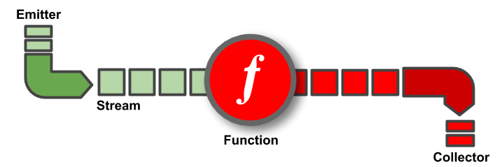

<h1 align="center">
    
</h1>

<h4 align="center">A data stream processing API for Go (alpha)</h4>
<br/>

[](https://godoc.org/github.com/vladimirvivien/automi)
[](https://travis-ci.org/vladimirvivien/automi)

Automi is an API for processing streams of data using idiomatic Go.  Using Automi, programs can process streaming of data chunks by composing stages of operations that are applied to each element of the stream.  

## Concept

<h1 align="center">
    
</h1>

<br/>

The Automi API expresses a stream with four primitives including:

- *An emitter*: an in-memory, network, or file resource that can emit elements for streaming
- *The stream*: represents a conduit whithin which data elements are streamed
- *Stream operations*: code which can be attached to the stream to process streamed elements
- *A collector*: an in-memory, network, or file resource that can collect streamed data.

Automi streams use Go channels internally to route data.  This means Automi streams automatically support features such as buffering, automatic back-pressure queuing, and concurrency safety.

## Using Automi

Now, let us explore some examples to see how easy it is to use Automi to stream and process data.  

>See all examples in the [./example](./examples) directory.

### Example: streaming from a slice into stdout

This first example shows how easy it is to compose and express stream operations with Automi.  In this example, rune values are emitted from a slice and are streamed invidividually.  Stream operator method `Filter` is applied to filter out unwanted rune values and the `Sort` operator method sorts the remaining items. Lastly, a `collector` is used to collect the result into an io.Writer and piped to `stdout`.

```go
func main() {
	strm := stream.New([]rune("B世!ぽ@opqDQRS#$%^&*()ᅖ...O6PTnVWXѬYZbcef7ghijCklrAstvw"))

	strm.Filter(func(item rune) bool {
		return item >= 65 && item < (65+26)
	}).Map(func(item rune) string {
		return string(item) 
	}).Batch().Sort() 
	strm.Into(collectors.Writer(os.Stdout))

	if err := <-strm.Open(); err != nil {
		fmt.Println(err)
		return
	}
}
```

> See the full [source code](./examples/emitters/slice0).

##### How it works

1. Create the stream with an emitter source. Automi supports several types of sources including channels, io.Reader, slices, etc. (see list of emitters below).  Each element in the slice will be streamed individually.

```go
strm := stream.New([]rune(`B世!ぽ@opqDQRS#$%^&*()ᅖ...O6PTnVWXѬYZbcef7ghijCklrAstvw`))
```


2. Apply user-provided or built-in stream operations as shown below:

```go
strm.Filter(func(item rune) bool {
    return item >= 65 && item < (65+26)
}).Map(func(item rune) string {
    return string(item)
}).Batch().Sort()
```

3. Collect the result.  In this example, the result is collected into an `io.Writer` which further streams the data into standard output:

```go
strm.Into(collectors.Writer(os.Stdout))
```

4. Lastly, open the stream once it is properly composed:

```go
if err := <-strm.Open(); err != nil {
    fmt.Println(err)
    return
}  
```

### Example: streaming from an `io.Reader` into collector function

The next example shows how to use Automi to stream data from an `io.Reader` emitting buffered string values from an in-memory source in 50-byte chunks.  The data is processed with a `Map` and `Filter` opertor methods and the result is sent to a user-provided collector function which prints the result.

```go
func main() {
	data := `"request", "/i/a", "00:11:51:AA", "accepted"
"response", "/i/a/", "00:11:51:AA", "served"
"response", "/i/a", "00:BB:22:DD", "served"...`

 	reader := strings.NewReader(data)
    
	// create stream from a buffered io.Reader emitter,
	// emitting 50-byte chunks.
	stream := stream.New(emitters.Reader(reader).BufferSize(50))
	stream.Map(func(chunk []byte) string {
		str := string(chunk)
		return str
	})
	stream.Filter(func(e string) bool {
		return (strings.Contains(e, `"response"`))
	})
	stream.Into(collectors.Func(func(data interface{}) error {
		e := data.(string)
		fmt.Println(e)
		return nil
	}))

	if err := <-stream.Open(); err != nil {
		fmt.Println(err)
		return
	}
}
```

> See complete example [here](./examples/emitters/reader/emitreader.go).

### Example: streaming using CSV files
The following example streams data from a CSV source file. Each row is mapped to a custom type, filtered, then mapped to a slice of strings which is then collected into another CSV file. 

```go
type scientist struct {
	FirstName string
	LastName  string
	Title     string
	BornYear  int
}

func main() {
    // creates a stream using a CSV emitter
    // emits each row as []string
    stream := stream.New("./data.txt")

    // Map each CSV row, []string, to type scientist
    stream.Map(func(cs []string) scientist {
        yr, _ := strconv.Atoi(cs[3])
        return scientist{
            FirstName: cs[1],
            LastName:  cs[0],
            Title:     cs[2],
            BornYear:  yr,
        }
    })
    stream.Filter(func(cs scientist) bool {
        return (cs.BornYear > 1930)
    })
    stream.Map(func(cs scientist) []string {
        return []string{cs.FirstName, cs.LastName, cs.Title}
    })
    stream.Into("./result.txt")

    // open the stream
    if err := <-stream.Open(); err != nil {
        fmt.Println(err)
        os.Exit(1)
    }
    fmt.Println("wrote result to file result.txt")
}
```

> See complete example [here](./examples/customtype/process.go).

### Example: streaming HTTP requests and responses
The following example shows how to use Automi to stream and process data using HTTP requests and responses.  The following HTTP server program streams data from the request Body, encodes it using base64, and streams the result into the HTTP response:

```go
func main() {

	http.HandleFunc(
		"/",
		func(resp http.ResponseWriter, req *http.Request) {
			resp.Header().Add("Content-Type", "text/html")
			resp.WriteHeader(http.StatusOK)

			strm := stream.New(req.Body)
			strm.Process(func(data []byte) string {
				return base64.StdEncoding.EncodeToString(data)
			}).Into(resp)

			if err := <-strm.Open(); err != nil {
				resp.WriteHeader(http.StatusInternalServerError)
				log.Printf("Stream error: %s", err)
			}
		},
	)

	log.Println("Server listening on :4040")
	http.ListenAndServe(":4040", nil)
}
```
> See complete example [here](./examples/net/http/httpsvr.go).

### Streaming gRPC service payload
The following example shows how to use Automi to stream data items from a gRPC streaming sevice.  The following gRPC
client setups an Automi emitter to emit time values that are streamed from a gRPC time service:

```go
// setup an Automi emitter function to stream from the gRPC service
func emitStreamFrom(client pb.TimeServiceClient) <-chan []byte {
	source := make(chan []byte)
	timeStream, err := client.GetTimeStream(context.Background(), &pb.TimeRequest{Interval: 3000})
	...
	go func(stream pb.TimeService_GetTimeStreamClient, srcCh chan []byte) {
		defer close(srcCh)
		for {
			t, err := stream.Recv()
			srcCh <- t.Value
		}
	}(timeStream, source)

	return source
}

func main() {
	...
	client := pb.NewTimeServiceClient(conn)
	// create automi stream
	stream := stream.New(emitStreamFrom(client))
	stream.Map(func(item []byte) time.Time {
		secs := int64(binary.BigEndian.Uint64(item))
		return time.Unix(int64(secs), 0)
	})
	stream.Into(collectors.Func(func(item interface{}) error {
		time := item.(time.Time)
		fmt.Println(time)
		return nil
	}))

	// open the stream
	if err := <-stream.Open(); err != nil {
		fmt.Println(err)
		os.Exit(1)
	}

}
```
> See complete example [here](./examples/grpc).

## More Examples
[Examples](./examples) - View a long list of examples that cover all aspects of using Automi.

## Automi components
Automi comes with a set of built-in components to get you started with stream processing including the followings.

### Emitters

* `Channel`
* `CSV`
* `io.Reader`
* `io.Scanner`
* `Slice`

### Operators

* `Stream.Filter`
* `Stream.Map`
* `Stream.FlatMap`
* `Stream.Reduce`
* `Stream.GroupByKey`
* `Stream.GroupByName`
* `Stream.GroupByPos`
* `Stream.Sort`
* `Stream.SortByKey`
* `Stream.SortByName`
* `Stream.SortByPos`
* `Stream.SortWith`
* `Stream.Sum`
* `Stream.SumByKey`
* `Stream.SumByName`
* `Stream.SumByPos`
* `Stream.SumAllKeys`

### Collectors

* `CSV`
* `Func`
* `Null`
* `Slice`
* `Writer`

## TODO

### Tasks

* [ ] Fix log - ability to turn off
* [ ] Remove dead code
* [ ] Add copyright to source files
* [ ] Doc wiki
* [x] Dependency mgmt

### Future

* [ ] Internal type hierarchy refactoring
* [ ] Error propagation and handling strategies
* [ ] Automatically turn on batch when batch operators are invoked
* [ ] Stream emitter - source from another stream
* [ ] Stream collector - sink into another stream
* [ ] New stream operators (join, split, broadcast, etc)
* [ ] Parallelization operator
* [ ] Add type-specific operators to streams
* [ ] Performance optimization


## Licence
Apache 2.0
